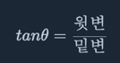

# Turtle neck 프로젝트 
*** 
- 약 200장 정도의 이미지를 크롤링해 귀와 경추 7번을 직접 라벨링하여 모델을 학습시켰다.  
- ACC와 같은 그래프들은 노트북을 바꾸면서 나라가버린 상태인데,, 다시 학습하게 된다면 올리겠다.  
- 정확도는 대략 80% 나오며, **그냥 재미로 만들어 본 것이니 너무 결과를 심각하게보진 말아줬으면 한다.**

 

### 사용 방법 
1. `pip install -r requirements.txt`   
2. `streamlit run app.py`

 

### 시연

  

> 아래 측정을 했을 때 결과를 알려줌 

 

### 거북목 공식 
tan 45도를 기준으로 하였을 때 45도 부분을 세타로 둔다면  

식이 이렇게 만들어지고, 밑변이 더 길어서 1아래라면 거북목 그렇지 않다면 정상이다.

