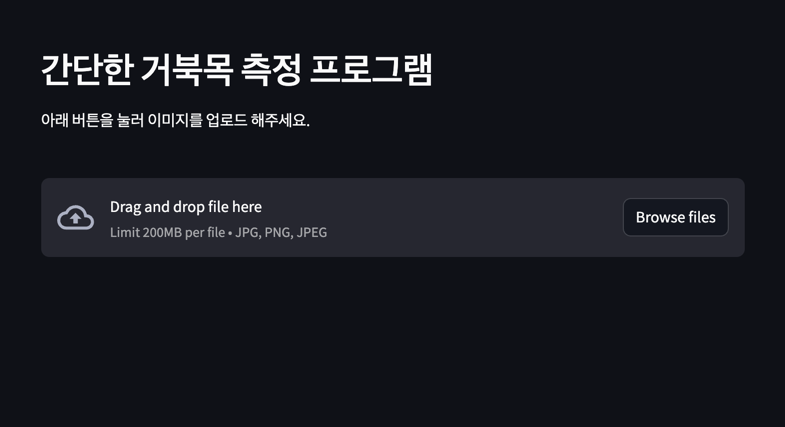
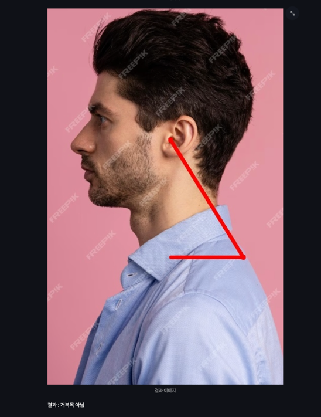

# Turtle neck 프로젝트 
*** 
- 약 200장 정도의 이미지를 크롤링해 귀와 경추 7번을 직접 라벨링하여 모델을 학습시켰다.  
- ACC와 같은 그래프들은 노트북을 바꾸면서 나라가버린 상태인데,, 다시 학습하게 된다면 올리겠다.  
- 정확도는 대략 80% 나오며, **그냥 재미로 만들어 본 것이니 너무 결과를 심각하게보진 말아줬으면 한다.**

 

### 사용 방법 
1. `pip install -r requirements.txt`   
2. `streamlit run app.py`

 

### 시연

  

> 아래 측정을 했을 때 결과를 알려줌 

 

### 거북목 공식 
삼각함수 tan를 이용하였다.   
tan45 = 1, 따라서 45일 경우에는 1이라는 뜻이다.   
45도 이하부터는 거북목이다 라는 정의는 한양대 장형규 석사학위 논문을 참고하였다.  

$$tanθ = \frac{윗변}{밑변}$$ 

